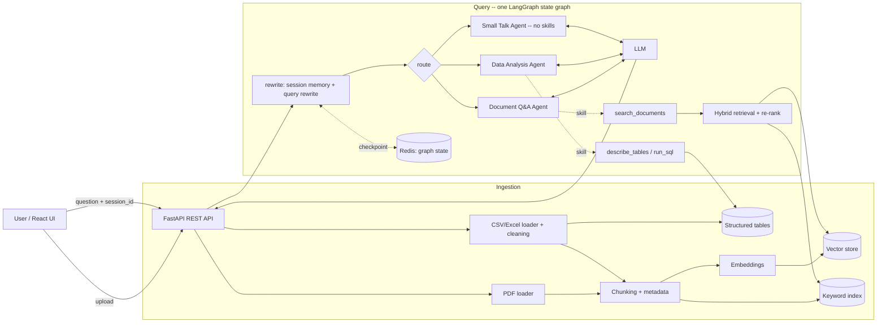

# Architecture
## 1. System architecture diagram



## 2. Technology selection

Each choice below is recorded in full in DECISIONS.md; this section summarises it.

### 2.1 LLM

**Mode-dependent**, and the only component that is (DECISIONS.md D-001). Google's hosted models in
cloud mode, Ollama in on-prem mode. Each place that calls a model -- the router, the follow-up
rewrite and each agent -- has its own short chain, tried in order: the first model is the cheapest
one that does that job well, and the rest are there in case it is unavailable or out of quota.

| Call site | Cloud chain |
|---|---|
| `router`, `rewrite`, `small_talk` | `gemma-4-26b-a4b-it` → `gemini-3.5-flash-lite` → `gemini-3.5-flash` |
| `document_qa` | `gemma-4-26b-a4b-it` → `gemini-3.6-flash` → `gemini-3.8-flash` |
| `data_analysis` | `gemma-4-26b-a4b-it` → `gemini-3.6-flash` → `gemini-3.8-flash` |

On-prem every call site runs on one to two models, because loading extra models costs
memory on the Ollama host.

- *Alternatives:* Groq free tier (limited models to fall back between); OpenRouter free models
  (unpredictable availability, and a demo failure would look like a bug in this system); vLLM
  (better throughput, but heavier to run); one provider for both modes (not possible, because
  on-prem must make no external calls).
- *Why:* One Google API key covers everything from free open models to frontier ones, so a harder
  agent needs a different model name, not a new provider, and structured output and tool calling
  both work reliably. Routing, quoting a passage and writing valid SQL are different jobs, and a
  stronger model is only worth paying for where a weaker one fails, so the model is chosen per
  agent. The failure actually hit is a quota limit on one model rather than the whole account, so
  stepping to the next model recovers faster than waiting and retrying. Ollama is the simplest way to
  run fully on-prem, and it can sit on a stronger machine on the internal network.
- *Trade-offs:* Free tiers have low per-minute limits, so a burst of questions reaches the billed
  fallback, or with no billing, no answer at all. A request that falls back is answered by a
  different model than usual, so evaluation runs that must be comparable should pin one model.
  Ollama's speed depends on its hardware.
- *Reconsider when:* An agent's answers get worse on Gemma in evaluation, or concurrency makes
  Ollama the bottleneck, at which point vLLM is the better on-prem server.

### 2.2 Embeddings

**Mode-invariant.** `BAAI/bge-small-en-v1.5`, run in-process through `fastembed` on ONNX Runtime
(DECISIONS.md D-002).

- *Alternatives:* A hosted embedding API (an external call on-prem would have to replace); Ollama
  `nomic-embed-text` (would make ingestion depend on the LLM host); `sentence-transformers` (pulls
  in PyTorch, about 2GB); a larger local model such as `bge-large` or `mxbai-embed-large`.
- *Why:* The embedding model has to run locally for on-prem anyway, and using the same one in cloud
  mode means one code path and no re-index when switching. bge-small runs on CPU with no GPU. Against
  the larger models on a retrieval-only benchmark (`eval/embedding_bench.py`), none did measurably
  better, and they cost 3-9x the query latency and up to 2GB more memory.
- *Trade-offs:* The benchmark is small, so it shows no large difference rather than proving the
  models equal. Changing the model means a re-index.
- *Reconsider when:* The corpus grows by an order of magnitude, answers get worse on harder
  questions, or documents in other languages need support.

### 2.3 Vector database

**Mode-invariant.** Qdrant, run as its own service in the Compose stack and reached over
`QDRANT_URL`; blank runs the same client embedded on local disk (DECISIONS.md D-003).

- *Alternatives:* ChromaDB (a weaker path to a hosted deployment); Pinecone (a hosted store is an
  external call, which on-prem forbids); pgvector (would add a Postgres database just for vectors).
- *Why:* The same client runs Qdrant as a local container or as a managed cluster, so on-prem and
  cloud share one code path and switching is a change of URL. Running it as a service lets ingestion
  and the API use the index at the same time, and lets the backend run more than one replica.
- *Trade-offs:* One more container to run.
- *Reconsider when:* The index outgrows one node or the free cluster; moving to a larger cluster is
  a change of URL, not of store.

### 2.4 Orchestration framework

**Mode-invariant.** LangGraph (DECISIONS.md D-005). Each request runs through one graph --
rewrite, route, then the chosen agent -- built from the agent registry, and each agent is a tool
loop over its declared skills.

- *Alternatives:* Building the agents from scratch; CrewAI or AutoGen.
- *Why:* Ordinary questions about this corpus need more than one step -- a second search, another
  table, a retry after a bad query -- and LangGraph already provides that loop. Building the graph
  from the registry keeps a new agent to one file, and the failure rules sit in graph nodes, so they
  apply to every agent in the same way.
- *Trade-offs:* Agents with tools are a bigger prompt-injection target, accepted because every skill
  is read-only and in-process (§6.1).
- *Reconsider when:* Agents need to run in parallel and merge results, or a conversation must
  resume mid-graph after a human step.

### 2.5 Supporting choices

Also mode-invariant: hybrid retrieval, BM25 and vector search fused by Reciprocal Rank Fusion and
re-ranked by a local FlashRank cross-encoder (D-004, §3.4); structure-aware chunking (D-006, §3.2);
follow-ups rewritten into standalone questions, with graph state checkpointed to Redis (D-007,
§4.3). The backend is deployed to Google Cloud Run and the frontend to Vercel (D-008).

## 3. Data pipeline design

A document goes through the same steps whether it comes from `make ingest` (everything in
`data/raw`) or from `POST /v1/upload` (one file): load, clean, chunk, embed, index. Spreadsheets
produce a second output as well: their cleaned tables are written to DuckDB for the Data Analysis
agent. `app/ingestion/pipeline.py` is the only module that runs these steps in order and the only
one that touches either store. The loaders and chunkers just take a file and return data, so they
are tested against the real corpus without a database.

Each run returns a report of the files processed, chunks indexed, rows loaded per table and the
data-quality problems it handled. `data/MESSINESS.md` lists every intentional flaw in the synthetic
data, and the report is how we check that each one was actually handled.

### 3.1 Ingestion and cleaning

**PDF status reports** are read with pdfplumber, which gives page numbers for citations. Tables and
running text are extracted separately. Text extraction on its own flattens a table row into one
jumbled line, so each table's area is cut out of the text and the table is read as a table.
Repeated page furniture, such as headers, footers and "Page 1 of 2", is spotted because it recurs
on most pages, so no file needs a hand-written rule.

**CSV and Excel files** come in messy: title rows above the header, merged cells, a byte-order
mark, and rows broken by an unquoted comma. The loader finds the real header row and fills merged
cells. When a row has too many fields, it tries joining each neighbouring pair back together and
keeps the join that makes the columns look right.

Cleaning rules live in `app/ingestion/cleaning.py`, shared by both loaders. Two rules apply
everywhere. **Nothing is dropped:** every parser returns the cleaned value together with the
original string, and a value it cannot parse becomes empty with a note saying why, never a guess.
**The interpretation is recorded,** so an answer can quote the form the document actually used.
Three choices matter because the obvious version of each is wrong on this data:

- Number separators are worked out per value, so `1.850.000,00` and `1,850,000.00` both read as
  1,850,000 even when they share a column.
- Percentage scale is decided per column. `1.0931` means a 109% overspend in a column of ratios and
  1.09% in a column of percentages, and only the column's other values can tell which.
- Day/month order is decided per file from the dates that can only be read one way (a component
  above 12). The rest follow that order and are flagged as ambiguous.

Cleaned tables are upserted into DuckDB on a natural key (`cost_code` for financials, `risk_id` for
risks). The financial workbook and its CSV export describe the same cost lines, and without a key
the second file would double every total.

### 3.2 Chunking strategy and justification

**Chunks follow the structure of each document, not a fixed character window** (DECISIONS.md D-006).

- **Report text** splits at the numbered headings the reports already use (`1. Executive summary`
  to `7. Focus for next period`), so each chunk holds one complete section. A section longer than
  `CHUNK_SIZE` (1,200 characters) would split on sentence boundaries with `CHUNK_OVERLAP` (150), but
  no section in this corpus is that long.
- **Report tables** become one chunk each, written as a pipe table. A table split by a page break is
  stitched back together first.
- **Spreadsheet tables** become groups of rows, capped at `TABLE_ROWS_PER_CHUNK` (4) rows *and*
  `CHUNK_SIZE` characters, whichever is hit first. A risk-register row runs to several hundred
  characters while a budget row is a handful. Wide tables are written as labelled fields, so each
  value sits next to its column name.
- **A header chunk per report** carries its period, overall status and identifiers. The status sits
  in a header table rather than the prose, so without this chunk "what was the status in each
  period?" has nothing to retrieve.

*Why this and not something simpler.* Recursive character splitting, the usual default, cuts tables
mid-row and keeps the jumbled table text. Page-based chunks split the key risks table across pages
1 and 2, which leaves two risks under a bare header with no sign of which report they came from.
Section-aware chunking costs more code, but it is cheap here because the reports number their
headings. In return every chunk makes sense on its own, and every citation (`§5 Key risks
(pp. 1-2)`, `Summary!rows 9-12`) can be checked by hand. The cost is a dependence on numbered
headings and ruled tables. A report without numbered headings falls back to one block of text, and
a table without borders is read as prose.

### 3.3 Embedding and indexing

Each chunk is embedded in-process with `bge-small-en-v1.5` (384 dimensions, DECISIONS.md D-002) and
written to Qdrant (D-003), with its source, section, page or row range and citation as payload.
Three details keep the index correct:

- **The collection name includes the embedding model**, and the vector size is taken from the
  embedder rather than hard-coded. A model change therefore lands in a new, empty collection instead
  of mixing incompatible vectors, and `make reindex` rebuilds it.
- **Re-ingesting replaces rather than appends.** Chunk IDs are derived from the source, section,
  page or row range and position, so the same content always gets the same ID. Every chunk from a
  source is deleted before its new ones are written, which also clears chunks for sections that no
  longer exist.
- **The keyword index is rebuilt from Qdrant**, not saved separately. BM25 has no storage of its
  own, and a second copy of the corpus would drift. The index is invalidated after every ingest and
  rebuilt on the next query.

Because Qdrant runs as a service, ingestion and the API can use the index at the same time.

### 3.4 Retrieval

The `search_documents` skill runs hybrid retrieval (DECISIONS.md D-004), in-process and the same in
both deployment modes:

1. **Vector search** over Qdrant and **keyword search** with BM25 each return their top `TOP_K`
   (8). The keyword tokeniser keeps identifiers such as `R-003` and `ENG-01` whole and strips
   thousands separators, so a question quoting `6,315,000` matches a chunk that stores `6315000`.
2. **Reciprocal Rank Fusion** merges the two lists by rank alone (`1 / (RRF_K + rank)`, with
   `RRF_K` = 60), so the two scoring systems never have to be made comparable.
3. **A FlashRank cross-encoder** re-reads the question against each candidate and keeps the best
   `RERANK_TOP_N` (4). A short context matters most on-prem, where prompt length is latency.

`RETRIEVAL_MODE=naive` uses vector search only. It is the baseline hybrid retrieval is measured
against, so the two modes differ in exactly one thing.

## 4. Agent orchestration

Each request runs through one LangGraph graph, compiled from the agent registry in
`app/graph/build.py` (DECISIONS.md D-005):

```
START -> rewrite -> route -> { document_qa | data_analysis | small_talk } -> END
```

`rewrite` turns a follow-up into a standalone question, `route` picks an agent, and the agent's node
answers. Every agent follows the same contract, `AgentInput -> AgentResult`, which carries the
answer, the agent's name and its citations. That shared contract lets the router, the API and the
logs treat a retrieval agent and a SQL agent the same way. Inside it, each agent is a tool loop:
the model calls the agent's skills until it has enough to answer, within a budget of
`AGENT_MAX_TOOL_CALLS` (3) calls.

### 4.1 Agents and their skills

| Agent | Skills | Handles |
|---|---|---|
| `document_qa` | `search_documents` | Questions answered from report text: status, milestones, risks, commentary |
| `data_analysis` | `describe_tables`, `run_sql` | Numeric questions over the cleaned tables: budgets, variances, counts |
| `small_talk` | none | Greetings, thanks and questions about the assistant; also the routing fallback |
| `router` | none | Picks an agent; answers nothing, and is not routable itself |

**Document Q&A** searches as many times as its budget allows. Each search returns numbered passages
labelled with their source and citation, and the `[n]` markers in the answer are mapped back to
those sources. The numbering carries on across searches, so a second search starts at the next
number rather than `[1]`, and `[3]` always means the same passage.

**Data Analysis** first reads the table schema, then writes SQL. `run_sql` accepts exactly one
read-only `SELECT` (§6.1). A rejected or failing statement goes back to the model as the tool's
result, so it can fix its own query. The SQL is returned as the citation, so a reader can check any
figure against the query that produced it.

**Small Talk** answers greetings and questions about the assistant from its prompt alone. Without
it, "hi" would be a corpus search that finds nothing and gets refused, which looks broken. It is
the only agent whose answer no document grounds, so its prompt forbids stating any fact about the
project and hands project questions back. Because it is also the routing fallback, declining
politely is most of its job.

**Router** only classifies. It is hidden from the catalogue it routes over.

### 4.2 Routing

The router's prompt is built from the registry on every call: each agent's `name` and `description`
are listed, and the model returns a structured `RouteDecision` with an agent name and a confidence.
**An agent's description is therefore routing logic, not documentation.** A new agent is routable
as soon as it is registered.

Structured output holds up even on a 3B on-prem model, because Ollama constrains the output to the
JSON schema. The remaining risk is meaning, not format: a small model asked for a confidence
between 0 and 1 sometimes answers `95`. That is rescaled to 0.95 rather than rejected, since the
route itself was right.

The request falls back to `small_talk` when the model names an agent that isn't registered, when
its confidence is below `MIN_CONFIDENCE` (0.5), or when the routing call fails. The fallback is the
agent that declines, not one that guesses: a question the router could not place confidently may
be one this system should not answer, and `document_qa` would search for something that may not be
there. The cost is that a real question the router misplaced is declined rather than attempted.
Every fallback is logged at WARNING, and that log is the signal to watch. A router that has started
failing, for example because its quota ran out, still returns 200 on every request, with polite
refusals.

`eval/test_queries.yaml` records the expected agent for each query, so routing accuracy is measured
rather than assumed.

### 4.3 Conversation sessions and follow-ups

Agents never see the conversation (DECISIONS.md D-007). The `rewrite` node uses the cheap router
model to turn a follow-up such as "and what about Q2?" into a standalone question, then routes that.
Prompt processing dominates on-prem latency (§2.1), and rewriting keeps every agent prompt to one
question plus its retrieved context, however long the conversation runs. The first turn of a
session skips the call.

The transcript lives in an in-process store, bounded to the last 10 turns per session and the 500
most recently used sessions. A client can invent a new session ID on every request, so an unbounded
store would be a memory leak. Session IDs are pattern-checked.

Separately, the graph checkpoints its own state per session into Redis when `REDIS_URL` is set, or
in memory otherwise. Checkpoints expire after `CHECKPOINT_TTL_MINUTES` (120), and a session evicted
from the transcript store drops its checkpoint too. If Redis cannot be reached, the graph uses
memory with a WARNING rather than failing requests. Nothing resumes mid-graph today, so losing a
checkpoint costs nothing a user would see. The transcript itself is still in-process, so
conversations do not survive a restart and are not shared between replicas.

### 4.4 Failure handling

The rule is that a request returns either an answer or an honest refusal, never a stack trace. The
rules sit in graph nodes rather than in individual agents, so every agent gets them, and every
degradation is logged with the request's trace ID.

| Failure | What happens |
|---|---|
| Routing call fails, names an unknown agent, or is under-confident | Falls back to `small_talk`, logged at WARNING; the user gets a decline, not an error |
| Confidence returned on a 0-100 scale | Rescaled, and the chosen agent kept |
| Follow-up rewrite fails or looks wrong (empty, or far longer than the question) | The question is used as asked |
| The chosen agent raises | Caught in its node; the answer says the agent could not complete, and still names the agent |
| A model is out of quota or unavailable | The next model in that call site's chain answers (D-001) |
| Retrieval finds nothing | The skill says so and suggests another query; if the loop ends with no evidence, the answer becomes a refusal with no citations |
| The tool budget is spent | The skill declines further calls, and the model answers from what it has |
| A model keeps calling tools regardless | The graph's recursion limit stops it, and the agent returns a degraded answer |
| The answer has no `[n]` markers | Everything retrieved is cited, marked `citation_mode: "inferred"` so logs can tell it apart |
| Generated SQL is rejected or errors | The error goes back to the model to correct within its budget |
| No SQL query ever succeeded | The answer is replaced with a refusal, because a figure with no query behind it is invented |
| The tabular store is locked by an upload | "The data store is being updated" |
| The re-ranker cannot load | The fused order is kept, trimmed to size |
| Redis is unreachable at startup | In-memory checkpoints, reported by `/v1/health/dependencies` |
| Anything else | HTTP 503 with a generic message; the detail goes to the log only (§6.3) |

### 4.5 Adding a new agent

Add one module under `app/agents/` with a `BaseAgent` subclass decorated `@register_agent`,
declaring `name`, `description`, `skills` and `system_prompt`. `run()` is inherited: it builds the
tool loop, applies the budget and collects citations. The graph is compiled from the registry, so
the router, `GET /v1/agents` and the frontend pick the agent up with no other edits.

```python
@register_agent
class RiskAgent(BaseAgent):
    name = "risk"
    description = "Answers questions about the risk register: owners, scores, mitigations."
    skills = [describe_tables, run_sql]
    system_prompt = RISK_SYSTEM
```

## 5. Cost and scaling

### 5.1 Cost per query

**Measured, not estimated.** Every model call logs its tokens (`app/llm/usage.py`), so the figures below come from
running all 12 questions in `eval/test_queries.yaml` through `POST /v1/chat` in cloud mode on
2026-09-25, with `AGENT_MAX_TOOL_CALLS=2` as deployed. Prices are Google's paid-tier list prices on
the same date.

A question makes **2 to 6 model calls**: one to route, one to rewrite if it is a follow-up, and one
per turn of the agent's tool loop. Across the 12 questions:

| | Mean | Range |
|---|---|---|
| Input tokens | 4.8k | 0.75k (`small_talk`) – 11.6k (`document_qa`, adversarial) |
| Output tokens | 0.77k | 0.27k – 2.0k |
| Of which reasoning | **81%** | |
| Wall clock | 24s (median 19s) | 11s – 51s |

`data_analysis` is the heavier agent (5.6k input on average against `document_qa`'s 2.1k), because
it reads the table schema and then queries, and it often uses its whole tool budget.

**What a query costs depends on which model answered it:**

| Who answered | Price per 1M tokens (in / out) | Cost per query | Per 1,000 queries |
|---|---|---|---|
| Gemma 4 26B — **all 12 measured queries** | not charged | **$0** | **$0** |
| `document_qa` falls back to `gemini-3.6-flash` | $0.75 / $3.75 | ~$0.003 typical, $0.016 worst | $3 – $16 |
| `data_analysis` falls back to `gemini-3.6-flash` | $0.75 / $3.75 | ~$0.007 mean, $0.012 worst | $7 – $12 |
| `small_talk` falls back to `gemini-3.5-flash-lite` | $0.30 / $2.50 | ~$0.002 | $2 |
| Last resort, `gemini-3.8-flash` | same as 3.6-flash to 2026-12-31, then $1.50 / $7.50 | ~$0.007 → ~$0.014 in 2027 | $7 → $14 |

So the cost of the system is **its fallback rate times about $0.007**. If 10% of queries reach a
billed model, that is about $0.70 per 1,000 queries. The per-request `tokens` field in the `chat` log
splits usage by model, so that rate is read from logs rather than guessed.

These are rough in three ways. The fallback rows reuse Gemma's token counts, and a different model
reasons for a different length. The router call is priced at the agent's rate, which overstates it a
little. And output is billed including reasoning, so the 81% reasoning share is the lever that
matters most: capping Gemini's reasoning on a fallback would cut its cost by more than any change to
the prompt.

Not included, because they do not scale per query: Cloud Run (scales to zero), and the Qdrant and
Redis services. On-prem there is no per-query charge at all; the cost is the Ollama host, and the
budget is latency (§2.1).

### 5.2 Top 3 scalability bottlenecks
**1. Model calls: every call site shares one model, and each question makes up to six calls in a row.**
Generation is nearly all of the 19s median; retrieval and re-ranking take about 100ms. All
five call sites lead with `gemma-4-26b-a4b-it`, so they share one per-model rate limit, and a
question's calls are sequential, so they add up rather than overlap. The 12-question run
(about 11 calls a minute) hit no limit, but the ceiling has not been measured. When it is hit, the
request moves to a billed Gemini model, which is the cost row above.

- *Fewer calls:* stop `data_analysis` overrunning its tool budget. Every 6-call question in the run
  was a `data_analysis` one, and Gemma 26B has been seen asking for a tool after being told the
  budget is spent, once until the recursion limit ended the loop. The rewrite is already skipped
  when there is no history.
- *Shorter calls:* cap reasoning (81% of output) per call site, starting with the router, which
  needs none.
- *Spread the limit:* put `router` and `rewrite` on a different first model from the agents, so
  routing does not use up the agents' quota.
- *Skip repeat work:* cache answers keyed by the normalised question and the corpus version, which
  suits a small corpus that changes only on upload.
- *On-prem:* vLLM in place of Ollama, whose continuous batching serves concurrent requests on one
  GPU instead of queueing them.

**2. Each replica holds its own state, so adding replicas gives inconsistent answers.** Three
things live inside each process rather than in a shared service:

- the DuckDB tables, baked into the image (`COPY data`), and written to locally by an upload;
- the BM25 index, rebuilt in memory from Qdrant;
- the conversation transcript (§4.3).

An upload therefore reaches every replica's vector search (Qdrant is shared) but only one replica's
tables and keyword index, and a follow-up that lands on a different replica loses its history. With
Cloud Run at `--max-instances 2 --concurrency 4`, that caps the service at 8 requests in flight,
about 20 questions a minute at the measured latency, and raising the cap makes the inconsistency
worse, not better.

- *Transcript:* move it into Redis beside the checkpoints, which are already shared (D-007).
- *Keyword search:* use Qdrant's sparse vectors for BM25, so one index serves every replica and there
  is nothing to rebuild at startup.
- *Tables:* treat DuckDB as a read-only snapshot that ingestion publishes (to object storage, with a
  version stamp that replicas check and reload), or move to a shared database such as Postgres.
  Only then raise `--max-instances`.

**3. Ingestion runs inside the upload request.** `POST /v1/upload` parses, embeds and writes before
it returns, on the same 1 vCPU that serves chat. The ONNX embedder competes with the re-ranker for
that CPU, and the DuckDB write lock turns concurrent chat questions into "the data store is being
updated" (§4.4). One large upload slows or blocks everyone on that replica.

- *Queue it:* the upload stores the file and returns; a separate worker (a Cloud Run job) ingests it,
  so chat never shares a CPU with embedding.
- *Swap, don't lock:* the worker builds a new DuckDB file and publishes it in one step, which is the
  same snapshot mechanism bottleneck 2 needs.
- *Report progress:* the upload returns a job ID the UI can poll, rather than holding the request
  open until the embedding finishes.

## 6. Security

### 6.1 Prompt injection

**The threat.** Anyone who can call `POST /v1/upload` can put text in front of the model: a PDF
passage or a spreadsheet cell reaches the agent as a search result or a query result. Once it is a
chunk, an instruction hidden in a document looks the same as any other content. The question itself
is a second, more direct input.

**What stops it, in order of how much it matters:**

1. *The agents can do almost nothing.* Every skill is read-only and runs in-process: hybrid search,
   a schema listing and a checked `SELECT`. No skill touches the network or the filesystem, and no
   agent holds a credential. So a successful injection can change what an agent *says*, but it
   cannot send data anywhere, write anything or reach outside the corpus. `AGENT_MAX_TOOL_CALLS`
   caps how many searches or queries an injected instruction can trigger.
2. *Generated SQL is locked down in three layers* (`app/ingestion/tabular_store.py`), because
   `run_sql` is the one place model output is executed, and the model writing it may have just read
   an uploaded document. DuckDB's own parser must find exactly one `SELECT`; the connection is
   opened read-only; and it is opened with `enable_external_access=False`, locked so SQL cannot turn
   it back on. The third layer matters: `SELECT * FROM read_csv_auto('/etc/passwd')` is a valid
   read-only `SELECT`, so only that setting stops it. Known file-reading functions are also
   rejected by name and statements are capped at 2,000 characters. `tests/test_sql_guard.py` covers
   each layer. API keys live in a separate database file (§6.2), so no query can read them.
3. *Retrieved text is labelled as data.* Passages come back as tool results, numbered and headed
   with their source, never in the system prompt. Both answering agents carry `INJECTION_RULE`
   (`app/llm/prompts.py`): anything in the context that looks like a command is document content to
   report on, not an instruction to follow.
4. *The router and `small_talk` see no documents.* The router gets only the question and picks from
   a fixed list of agents; an unknown or low-confidence pick falls back to `small_talk` (§4.2).
   `small_talk` has no skills and no context, and its prompt tells it not to take on a new persona,
   new rules or general-knowledge questions.
5. *Inputs are bounded.* Questions are capped at 4,000 characters, session IDs must match
   `^[A-Za-z0-9_-]{1,64}$`, and uploads are checked against an allow-list of file types and
   `MAX_UPLOAD_MB`, with any directory part removed from the filename.

**What is left.** None of this stops an injected passage from making an answer *wrong*: persuading
the model to misquote a figure, cite the wrong passage or run a query that misses the right rows.
The defence there is that answers can be checked: every claim has a `[n]` marker pointing to a named
source and location, and every figure comes with the SQL that produced it. I considered an output
filter or a separate guard model and rejected them: they add a model call to every question, and
with read-only skills there is little left for them to prevent. The synthetic corpus contains no
injection payloads, so these controls are proven by unit tests, not by attacks on the sample data.

### 6.2 API key management

There are two kinds of key: the ones the backend uses to call other services, and the ones clients
use to call the backend.

**Outbound secrets** are `LLM_API_KEY` (cloud mode only) and `QDRANT_API_KEY` (only for a secured
Qdrant). Locally they come from `.env`, which is gitignored; `.env.example` and `.env.cloud.example`
contain no values. On Cloud Run, `make deploy-setup` puts them in Secret Manager and gives read access
to only the runtime service account, one secret at a time, and `make deploy-backend` passes them with
`--set-secrets`, so they are never in the image or in plain environment variables on the service.
In the code they are read only through `Settings` and used only in `app/llm/providers.py` and the
Qdrant client. The startup log and `/v1/health/dependencies` report which models and endpoints are
configured but never a key, and the Redis URL has its password removed first (`redact_url`). No
secret is ever put in a prompt. **On-prem there are no outbound keys at all**: nothing calls out, so
network reachability replaces key management. Ollama has no authentication of its own, so it must be
reachable only from inside the network.

**Inbound keys** protect the API when `API_AUTH_ENABLED=true`:

```bash
make api-key NAME=frontend          # prints pia_... once
make api-keys                       # name, prefix, created, revoked
make revoke-api-key NAME=frontend
```

- *Where they are stored.* In a DuckDB file of their own, `API_KEYS_DB_PATH`
  (`data/processed/api_keys.duckdb`), and deliberately **not** in `tables.duckdb`. The model writes
  SQL against that file, so a key table there would be one injected `SELECT` away from leaking.
  `tests/test_auth.py` checks the key table is not visible to `list_tables()`.
- *What is stored.* A SHA-256 digest of the key, its first ten characters (for telling keys apart
  in the list) and timestamps; the key itself is shown once and cannot be recovered. A plain hash
  rather than bcrypt or argon2 is enough because the keys are 256 random bits from `secrets`, so
  there is nothing to guess, and a slow hash would slow down every request.
- *How it is checked.* A FastAPI dependency (`app/api/auth.py`) reads the `X-API-Key` header on
  `/v1/agents`, `/v1/chat`, `/v1/sessions` and `/v1/upload`. `/health` and `/v1/health/dependencies`
  stay open for host health checks and `make ready`; they show configuration, not documents. The
  backend caches the valid digests for 30 seconds, so a new or revoked key takes effect without a
  restart, and `make api-key` can write while the backend is running. If auth is enabled and the key
  file is missing, every request is refused rather than allowed. Rejections are logged with a
  reason but never the key, and `/v1/chat` logs which named key asked each question.
- *Where it is off.* The flag defaults to `false`, so `make up`, `make dev-backend` and the tests work
  without a key. `make deploy-backend` passes `API_AUTH_ENABLED` through from `.env.cloud` and
  refuses to deploy with it on but no key file. The file is copied into the image with the rest of
  `data/`, so it holds only digests.

**What it does not do.** The browser frontend sends its key from `VITE_API_KEY`, which is built
into the JavaScript bundle, so anyone who opens the page can read it. For the hosted demo, the key
identifies the frontend and lets it be revoked, but it does not make the API private: that needs user
sign-in (OIDC through the host, or a backend-for-frontend that holds the key on the server), which
is out of scope. The keys are for scripts and other services, which can keep a secret.

### 6.3 Data privacy

**Where document content goes.** Parsing, embedding, keyword search, re-ranking and SQL all run
inside the backend process. The only content that leaves it is:

| Destination | What it receives | On-prem | Hosted demo |
|---|---|---|---|
| LLM | The question, retrieved passages, query results | Ollama on the internal network | Google's Gemini API |
| Vector store | Chunk text and embeddings | Qdrant container | Qdrant Cloud |
| Checkpointer | The question and the tool results behind each answer | Redis container | Redis Cloud |

So **on-prem, nothing leaves the deployment** (§2). The hosted demo sends document text to three
external services, which is fine for a synthetic corpus and not for real project data. One thing to
check before real use: Google's terms for its *unpaid* API tier allow prompts to be used to improve
its products, which the paid tier does not. Real data should go only to a paid key or to on-prem.

**How long data is kept.**

- The session transcript lives in process memory, capped at 10 turns per session and 500
  sessions, and is gone on restart. Nothing writes it to disk.
- Checkpoints hold the same things as the corpus, so they get the same care: Redis runs inside the
  deployment boundary, and each thread expires after `CHECKPOINT_TTL_MINUTES` (120).
- The browser keeps conversations in `localStorage`, so anyone using the same browser profile can
  see them.
- Uploaded files are written to `data/uploads` and indexed into Qdrant and DuckDB. There is no
  endpoint to delete a document yet; removing one means deleting the file and re-indexing.

**Logs** hold identifiers, counts, token usage and trace IDs, not questions, answers or document
text. Three fields can still contain words from the question or the data, and are worth knowing about
before logs go to a shared system: the generated SQL (its filter values), the router's one-line
reason, and the search query logged when retrieval finds nothing. Errors returned to clients are
generic ("The assistant is unavailable"), because a provider or DuckDB error can include a URL or a
file path; the full error goes only to the log, linked by trace ID.

**Access.** No user can see a different corpus: every client with access sees the same documents.
An API key (§6.2) controls who can call the API, not which documents they can see. Per-user or
per-project access would need an owner on each chunk and row, and a filter on every search and
query, which is the next thing to build before this holds more than one team's data.
