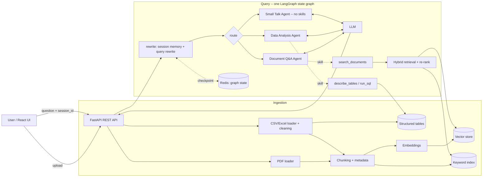

# Architecture

_Target length: 2–3 pages._

## 1. Overview

## 2. System architecture diagram



## 3. Technology selection

For each: choice · alternatives considered · why · trade-offs accepted · when to reconsider.

The system runs in two deployment modes, selected by `DEPLOYMENT_MODE`: `cloud` (default, hosted
LLM) and `onprem` (no external API calls). **Only the LLM differs between them.** Everything in
3.2–3.4 stays inside the deployment (in-process, or the Qdrant and Redis containers beside it) and is
mode-invariant, which is what makes the switch a single configuration change — see §9 and DECISIONS.md D-010. Full reasoning for each choice is in
DECISIONS.md; this section is the summary.

### 3.1 LLM

**Mode-dependent.** Cloud: Google Gemini `gemini-2.5-flash` (free tier). On-prem: Ollama
`qwen2.5:7b`, reachable at any `OLLAMA_BASE_URL` on the internal network. Routing and follow-up
rewriting use a cheaper model in each mode (`gemini-2.5-flash-lite` / `llama3.2:3b`), because
choosing between a handful of agents does not need the answering model.

- *Alternatives:* Groq (fastest hosted inference, no embedding models); OpenRouter free models
  (unpredictable availability); vLLM or TGI on-prem (better concurrency, heavier to operate).
- *Why:* Gemini's free tier needs no billing relationship and has dependable structured output,
  which the router relies on. Ollama is the lowest-friction way to meet the on-prem constraint and
  can run on a more powerful machine than the application host.
- *Trade-offs:* Free-tier rate limits throttle RAGAS runs. On-prem latency is hardware-dependent and
  can be an order of magnitude worse (see §7.1), so request timeouts are mode-dependent.
- *Reconsider when:* Rate limits block evaluation, a GPU host appears, or concurrency makes
  per-request Ollama inference the bottleneck.

### 3.2 Embeddings

**Mode-invariant.** `BAAI/bge-small-en-v1.5` (384-dimensional) executed in-process on ONNX Runtime
via `fastembed`.

- *Alternatives:* A hosted embedding API (rejected — see below); Ollama `nomic-embed-text` (equally
  on-premises, but 768-dimensional and dependent on a running Ollama); `sentence-transformers`
  (pulls PyTorch, roughly 2GB).
- *Why:* This choice is what makes the single-switch guarantee honest rather than a claim. A hosted
  embedder would change vector dimensions between modes, so switching would mean a full re-index —
  two changes and a data migration. Keeping embeddings local and identical means the switch needs no
  re-index and an index built in cloud mode is valid on-prem. It also removes rate limits from
  ingestion and makes the evaluation baseline deterministic.
- *Trade-offs:* ~150MB of weights downloaded on first run and held resident; a small model retrieves
  less well than a larger one. Changing the embedding model is the one change that is *not*
  configuration-only, so the model name is stamped into the Qdrant collection name and a mismatch
  fails loudly rather than querying incompatible vectors.
- *Reconsider when:* Context recall plateaus below target, or the corpus becomes multilingual.

### 3.3 Vector database

**Mode-invariant.** Qdrant, run as its own container in the Compose stack (`QDRANT_URL`). The same
client also runs it embedded from a local path when `QDRANT_URL` is blank, which is the no-server
fallback for a single-process checkout.

- *Alternatives:* ChromaDB (more conventional, weaker path to a hosted deployment); FAISS (fastest
  to stand up, no real filtering or server story); Pinecone (rejected — a hosted store is an
  external call that on-prem mode forbids).
- *Why:* Self-hostable stores were the only candidates that can satisfy on-prem mode at all — the
  Qdrant container runs on the same network as everything else and calls nothing out. Running it as
  a service removes the embedded directory lock, so ingestion and the API hold the index at the same
  time and the backend can be scaled past one replica.
- *Trade-offs:* Less familiar than Chroma. A third container, and an index that lives in a Docker
  volume rather than in `data/`, so it is `make clean` (or a volume backup) rather than a file copy.
  The embedded fallback keeps the directory lock, which is why the readiness probe checks path
  writability there and opens a client only against a server.
- *Reconsider when:* One Qdrant node stops being enough — the same client reaches a cluster, so that
  is a deployment change, not a store change.

### 3.4 Orchestration framework

**Mode-invariant.** LangGraph for orchestration, LangChain for model interfaces, prompt
composition and structured output. A request is one state graph -- `rewrite -> route -> <agent>` --
compiled from the in-repo agent registry, and each agent is a `create_agent` tool loop over the
skills it declares. See DECISIONS.md D-015, which amends D-006.

- *Alternatives:* Keeping the hand-rolled single-hop dispatch and adding tools inside it; CrewAI or
  AutoGen; no framework, calling provider SDKs directly.
- *Why:* D-006 chose against LangGraph while the orchestration was one classification step and one
  agent call, and named the condition for changing that: an agent needing a tool loop. Answering
  real questions about this corpus needs one -- searching again with different wording, consulting
  a second table, correcting a rejected statement. The graph is built *from* the registry, so the
  property D-006 was protecting holds: an agent is still one module, and adding it edits nothing
  else.
- *Trade-offs:* Every loop iteration is another generation, which is minutes on the on-prem host
  measured in section 7.1, so the loop is explicitly budgeted (`AGENT_MAX_TOOL_CALLS`). Retrieval
  stops being deterministic per question, which makes evaluation noisier. And the agents now hold
  tools, which section 8.1 had relied on them not having.
- *Reconsider when:* Agents must run in parallel and have results merged, or a conversation must
  resume mid-graph after an interrupt.

### 3.5 Supporting choices

Also mode-invariant, with full entries in DECISIONS.md: hybrid retrieval as BM25 (`rank_bm25`) fused
with dense results by Reciprocal Rank Fusion (D-004); re-ranking by a local ONNX cross-encoder via
FlashRank (D-005); tabular questions answered by generated SQL against a read-only DuckDB connection
rather than executed Python (D-007); PDF parsing with pdfplumber, which yields page numbers for
citations; graph state checkpointed to Redis, which is where the LangGraph saver ecosystem is
strongest and which the deployment can run as one more container on its own network (D-017).

## 4. Data pipeline

`data/raw` -> loaders -> cleaning -> chunking -> embeddings -> Qdrant, with cleaned tables also
written to DuckDB for the Data Analysis Agent. `app/ingestion/pipeline.py` is the only module that
sequences these; the loaders and chunkers are pure functions over files, which is what lets them be
tested against the real corpus without a database.

Run it with `make ingest` (or `POST /v1/upload` for a single file). The run returns a report naming
the files processed, chunks indexed, rows loaded per table, and **which flaw classes it handled** —
the last of these is what `data/MESSINESS.md` is checked against.

### 4.1 Ingestion and cleaning

Value normalisation lives in `app/ingestion/cleaning.py`, shared by both loaders, with each function
naming the flaw IDs it covers so the code and `data/MESSINESS.md` stay traceable to one another. Two
rules hold throughout: **nothing is dropped** (every parser returns the normalised value *and* the
raw string; an unparseable value comes back as `None` with an issue code, never silently coerced),
and **the interpretation is recorded** so an answer can cite the form the document actually used.

Three decisions there are worth stating, because the naive version of each is wrong on this corpus:

- **Separators are sniffed per value, not per locale.** The last separator present is the decimal
  separator, so `1.850.000,00` and `1,850,000.00` both read as 1850000.00 and can coexist in one
  column — which they do in the financial workbook.
- **Percentage scale is decided per column, not per value.** `1.0931` is a 109% overspend in a
  ratio-scaled column and 1.09% in a percent-scaled one, and no per-value rule can tell them apart.
  The column settles it: its neighbours are 0.77 and 0.72.
- **Day/month order is inferred per file from the values that cannot be ambiguous.** A component
  above 12 is decisive (`03/20/2026` can only be mm/dd), and the dominant style is then applied to
  the genuinely ambiguous ones, which are flagged rather than silently resolved.

PDF extraction is structural. Repeated header/footer furniture is **detected** rather than named —
lines recurring across most pages, compared with digits blanked so `Page 1 of 2` and `Page 2 of 2`
match — and the once-per-document sign-off is removed by noticing it is built from the report's own
metadata values. Tables are read with `find_tables()` and their bounding boxes excluded from the
narrative text, because `extract_text()` flattens a table row into
`Usage metering pipeline Hannah 03/20/2026 In-progress Lands with a 36h lag; batching` /
`Okonkwo work to follow.` — splitting the owner across lines and interleaving it with the comment.
Indexing both forms would mean indexing the same content twice, once badly.

A CSV row broken by an unquoted comma is repaired rather than discarded: each adjacent pair is tried
as a rejoin, scored on how many typed columns parse **and** whether each cell is a plausible length
for its column. Both signals are needed — parsing alone ties, because shifting every field by one
still leaves the dates and the amount readable, and the tie breaks only on noticing that a
60-character risk ID is not credible when every other ID is five characters.

### 4.2 Chunking strategy and justification

**Chunks follow the structure of the source, not a fixed character window.**

- **PDF narrative** splits at the numbered headings the reports already use (`1. Executive summary`
  … `7. Focus for next period`), so a chunk is a whole thought. A section longer than `CHUNK_SIZE`
  splits on sentence boundaries with `CHUNK_OVERLAP`; in this corpus no section is.
- **PDF tables** are one chunk each, rendered as a pipe table, including a table stitched back
  together across a page break.
- **CSV/Excel tables** become row groups bounded by *both* `TABLE_ROWS_PER_CHUNK` and `CHUNK_SIZE`,
  whichever binds first, because a risk-register row runs to several hundred characters while a
  by-period row is a handful. Wide tables render as labelled fields rather than pipe rows, which
  keeps each value next to its column name.
- **A synthetic header chunk** carries each report's period, status and identifiers. The overall
  status lives in the header table rather than the prose, so without it "what was the status in each
  reporting period" has nothing to retrieve.

The alternatives were rejected on specifics of this corpus rather than in principle. *Recursive
character splitting* — the conventional default — cuts tables mid-row and inherits the flattened
table text above. *Page-based chunking* splits the Key Risks table across the page 1/page 2 boundary,
leaving R-002 and R-009 in a chunk whose header row says only `ID | Risk | Owner | Score |
Mitigation` with no indication of which report it came from. Section-aware chunking costs more code;
what it buys is that every chunk is self-describing and every citation is verifiable by hand.

Chunk IDs are `uuid5` over (source, section, page/row range, ordinal), so **re-ingesting a file
replaces its chunks instead of duplicating them**. Each source's existing points are deleted before
re-upsert, which also clears orphans when a file shrinks — deterministic IDs alone would leave a
removed section's chunks behind, still retrievable.

### 4.3 Embedding and indexing

`fastembed` (bge-small-en-v1.5, 384-dim, in-process) embeds each chunk; vectors and payloads go to
Qdrant under a collection name that encodes the embedding model. The collection is created with a
vector size **probed from the configured embedder** rather than a hardcoded 384, so a model change
cannot produce a wrongly-sized collection — it lands in a new, empty one instead, and `make reindex`
is the documented recovery.

Qdrant runs as a service, so ingestion and the API write and read the same index concurrently:
`make ingest` runs from the host against `localhost:6333` while the stack stays up. Blanking
`QDRANT_URL` falls back to the embedded store, which locks its directory — one process at a time,
and the API has to be stopped before ingesting.

### 4.4 Retrieval (beyond naive similarity)

Three stages, all in-process and identical in both deployment modes:

1. **Dense** search over the Qdrant collection.
2. **Keyword** search with BM25 over the same chunks. The tokeniser keeps identifiers intact
   (`R-003`, `ENG-01`, `/v1/chat`) and strips digit-group separators, so a question quoting
   `6,315,000` matches a chunk that stores `6315000`.
3. **Reciprocal Rank Fusion** combines the two lists as `Σ 1/(RRF_K + rank)`. Using rank alone means
   a cosine similarity and a BM25 score never have to be made comparable, and there is no weight to
   tune. A **FlashRank cross-encoder** then re-reads the question against each candidate and cuts to
   `RERANK_TOP_N`, which matters most on-prem where prompt length is measurable latency.

`RETRIEVAL_MODE=naive` returns stage 1 only and is the baseline the hybrid path is evaluated
against, so the two modes differ in exactly one thing: whether the keyword list participates.

**BM25 is rebuilt from the Qdrant payloads**, not persisted separately. `rank_bm25` has no
persistence of its own, and a sidecar file would be a second copy of the corpus to keep in step.
Reconstructing from the payloads keeps Qdrant the single source of truth; without it a restarted
container would silently serve vector-only results while still reporting `RETRIEVAL_MODE=hybrid`.

## 5. Agent orchestration

A request is one LangGraph state graph, compiled from the registry in `app/graph/build.py`:

```
START -> rewrite -> route -> { document_qa | data_analysis | small_talk } -> END
```

Every agent implements one contract, `AgentInput -> AgentResult` (`app/agents/base.py`). That is
what lets the router, the API and the logs treat a retrieval agent and a SQL agent identically, and
what makes a new agent a new file rather than a change to the dispatch path. Inside that contract an
agent is a **tool loop**: `BaseAgent.run()` builds a `create_agent` harness over the agent's
`skills` and runs it until the model stops calling them (D-015).

### 5.1 Agents and their skills

Skills live in `app/skills/`, not in `app/agents/` -- `discover_agents()` imports every module in
the agents package looking for agents, so a shared module there is imported on every registry call
and found to contain none.

| Agent | Skills | What the skill does |
|---|---|---|
| `document_qa` | `search_documents` | Hybrid retrieval, re-ranked; returns numbered passages |
| `data_analysis` | `describe_tables`, `run_sql` | Schema listing; one validated read-only `SELECT` |
| `small_talk` | none | Nothing to do; answers from its prompt and looks nothing up |
| `router` | none | Classifies only; answers nothing |

**Document Q&A** (`app/agents/document_qa.py`) answers from narrative text. The model calls
`search_documents` as often as its budget allows, each call returning passages numbered with the
source file and the citation built at ingest; the `[n]` markers in the answer are then mapped back
to `Citation` objects. Retrieval is synchronous and CPU-bound -- ONNX embedding, BM25 scoring and a
cross-encoder pass -- so the skill runs it via `asyncio.to_thread` rather than blocking the event
loop.

**Data Analysis** (`app/agents/data_analysis.py`) answers numeric questions. `describe_tables`
supplies the schema and `run_sql` validates and executes one `SELECT` read-only. A rejected or
failing statement is **returned to the model as the tool's result**, so the correction is the
model's own -- which replaces the single hard-coded retry the fixed pipeline used. The SQL travels
back as the citation snippet, so a reader can check any figure against the statement that produced
it.

**Small Talk** (`app/agents/small_talk.py`) answers greetings, thanks and questions about the
assistant itself. It exists because "hi" is otherwise a corpus search that retrieves nothing and is
refused, which reads as a broken system rather than a polite one. It is the only agent whose answer
is not grounded in a document, so its remit is drawn narrowly and enforced in the prompt: it states
no fact about the project, and a project question that reaches it is handed back rather than
attempted. It holds no skills, which `create_agent` accepts -- the loop simply ends on the first
turn. It is also the routing fallback (§5.2), so declining a question it cannot answer is the larger
half of its job, and its prompt is written for that case rather than only for greetings (D-018).

**Router** (`app/agents/router.py`) classifies only. It answers nothing itself, holds no skills, and
is hidden from its own catalogue.

**Citations across a loop.** A model that searches twice cannot be given two lists both numbered
from `[1]`. Skills therefore record what they returned into a per-invocation collector
(`app/skills/evidence.py`, a ContextVar mirroring `trace_id_var`) which assigns the numbering, so
`[3]` denotes the same passage whichever call produced it. The collector also holds the tool budget,
since it is already the thing counting calls.

The agents now hold tools, which section 8.1 previously relied on them not doing. Every skill is
read-only and stays in-process, and the one place model output becomes executable is still the
generated SQL -- now reachable repeatedly, which is why the containment there is load-bearing rather
than defence in depth.

### 5.2 Routing

The routing prompt is built from the registry at call time: `RouterAgent.agent_catalogue()` renders
each registered agent's `name` and `description`, so **a description is routing logic, not a
comment**. The model returns a `RouteDecision` through `.with_structured_output()`.

Structured output is dependable even on a 3B model, because `ChatOllama` defaults to
`method="json_schema"` -- grammar-constrained decoding, so the JSON shape cannot come back
malformed. The residual risk is semantic, not syntactic: a small model asked for a 0-1 confidence
readily answers `95`, meaning 95%. That would sail past the floor and be recorded as nonsense, so
`_normalised()` rescales it rather than rejecting it -- a route that was correct but reported on the
wrong scale is worth keeping.

Routing is the graph's `route` node, and `RouterAgent.route()` is the one place the fallback rules
live. Selecting the node is a conditional edge, which re-checks that the chosen name is a node in
*this* compiled graph -- they can differ if an agent was registered after the graph was compiled.

Below `MIN_CONFIDENCE` (0.5), or on a name that is not registered, the request falls back to
`small_talk`. The fallback is the agent that answers nothing from the corpus, because a route the
model could not make confidently is as likely to be a question this system has no business
attempting as one it does: `small_talk` declines cleanly and says what the assistant covers, where
`document_qa` would search for something that may not be there and `data_analysis` would degrade to
a SQL error. The cost is that a real question the router merely failed to place is declined rather
than attempted (D-018).

Every fallback is logged at WARNING, and with this fallback that log is the only signal there is: a
router that has quietly started falling back on everything -- a spent quota, an unreachable endpoint
-- turns the whole system into a polite deflection while every request still returns 200.

`eval/test_queries.yaml` carries an `expected_agent` per query, so routing accuracy is an evaluation
dimension rather than only a log field.

### 5.3 Conversation sessions and follow-ups

`app/memory/session_store.py` holds conversations in-process and rewrites a follow-up into a
standalone question before routing, so agents never see conversation state.

Rewriting rather than growing the prompt is a latency decision as much as a design one. Section 7.1
measured 154s over 2,145 input tokens against 74 output: prompt processing dominates on-prem. A
rewrite keeps every downstream prompt the size of one question plus its retrieved context, whatever
the conversation length. The first turn of a session skips the call entirely, since there is nothing
to resolve.

The store is bounded on both axes -- turns within a session and sessions within the process --
because a client is free to invent a session ID per request, and an unbounded store would make that
a memory leak. `/v1/chat` also pattern-validates the ID. Access is guarded by a lock: FastAPI
serves handlers concurrently and agent work runs on worker threads, so LRU eviction is a compound
operation.

The graph additionally checkpoints its state per session (`thread_id` = session ID) into Redis,
selected by `REDIS_URL`; blank keeps the `InMemorySaver` it started with, which is what the test
suite and a single-process run use. That is graph state, not conversation context: rewriting is kept
precisely so that what reaches an agent stays one question however long the conversation runs
(D-015).

Checkpoints are bounded twice, because once the keys outlive the process neither bound is enough on
its own. Session eviction still reaches the checkpointer -- an evicted session drops its thread --
which is what stops a client inventing a session ID per request from growing the store. But that
store is process-local, so a restart would orphan every thread it would have evicted;
`CHECKPOINT_TTL_MINUTES` expires those, refreshed on read so an active conversation is never expired
underneath itself.

An unreachable Redis degrades to the in-process saver with a WARNING rather than failing the
request, and `/v1/health/dependencies` reports the target. Nothing resumes mid-graph today, so a
checkpoint no user ever reads is not worth a 503 (D-017).

**Conversation history is still in-process: it does not survive a restart and is not shared between
replicas.** Only the checkpoints moved, so conversational continuity still assumes a single backend
instance. See DECISIONS.md D-013.

### 5.4 Failure handling

The rule is that a request returns an answer or an honest refusal, never a stack trace. Every
degradation is recorded in the structured log with the request's trace ID.

| Failure | Behaviour |
|---|---|
| Routing model unreachable, times out, or returns nonsense | Fall back to `small_talk`, logged at WARNING; the request succeeds, but the answer is a decline rather than an attempt |
| Model names an unknown agent, or confidence is below the floor | Fall back, `confidence: 0.0` recorded in `metadata["routing"]` |
| Confidence returned on a 0-100 scale | Rescaled, and the chosen agent kept |
| The checkpoint store is unreachable | The graph degrades to the in-process saver for the life of the process, logged at WARNING and reported by `/v1/health/dependencies`; the request still answers |
| The chosen agent raises | Caught in the agent node; a degraded `AgentResult` carries `metadata["error"]`, and the answer still reports which agent handled it |
| Retrieval returns nothing | The skill says so and invites a different query; if the loop ends with no evidence at all, the answer is replaced by a refusal with zero citations |
| A skill exhausts the tool budget | The skill declines and says so, so the model answers from what it already has rather than the request failing |
| A model keeps calling tools after the budget is spent | `recursion_limit` raises, which the agent node turns into a degraded result |
| The answer carries no `[n]` markers | Cite everything retrieved and record `citation_mode: "inferred"`, so logs and evaluation can tell it from a marked answer |
| Generated SQL is rejected or fails to execute | The error is returned to the model as the tool result, for it to correct within its budget |
| No query ever succeeded | The answer is replaced -- a figure with no query behind it is invented -- passing through whatever the skills reported |
| Tabular store held open by an upload | "The data store is being updated" -- DuckDB allows one configuration per path per process |
| Follow-up rewrite fails, or returns something implausible | Use the question as asked |
| Re-ranker cannot load | Keep the fused order, trimmed |
| Anything else in the handler | HTTP 503 with a generic detail; the exception goes to the log only (section 8.3) |

### 5.5 Adding a new agent

Create one module under `app/agents/` with a `BaseAgent` subclass decorated `@register_agent`,
defining `name`, `description`, `skills` and `system_prompt`. `run()` is inherited: it builds the
tool loop, budgets it and collects evidence. Override `finalise()` only to shape the `AgentResult`.
`discover_agents()` imports every module in the package and the graph is compiled from the registry,
so the router, `GET /v1/agents` and the frontend pick the agent up with no further edits.

```python
@register_agent
class RiskAgent(BaseAgent):
    name = "risk"
    description = "Answers questions about the risk register: owners, scores, mitigations."
    skills = [describe_tables, run_sql]
    system_prompt = RISK_SYSTEM
```

Four things are worth knowing:

- **The `description` is a prompt.** It is written for a 3B classifier, so it should name the nouns
  real questions will use rather than describe the implementation.
- **`tests/test_health.py` asserts the exact routable set**, so adding an agent is a deliberate
  two-line test change rather than something that happens by accident.
- **A non-agent module in `app/agents/` must be added to `_NON_AGENT_MODULES`**, and nothing fails
  if you forget -- discovery just imports it on every `list_agents()` call and finds nothing. Because
  that rot is silent, shared helpers live elsewhere: prompts in `app/llm/prompts.py`, skills in
  `app/skills/`, the graph in `app/graph/`, and the SQL guard in `app/ingestion/tabular_store.py`
  beside the connection it protects.
- **A skill must be a LangChain tool**, and `register_agent` rejects a bare function: the failure
  would otherwise surface deep inside a model call, in a traceback naming neither the agent nor the
  skill. Skills should be read-only and in-process, for the reason section 8.1 gives.

## 6. Observability

`RequestContextMiddleware` assigns a trace ID per request -- taken from an inbound `x-trace-id` or
minted -- into a contextvar, and echoes it on the response. `JsonFormatter` stamps it onto every log
record, so one grep reconstructs a whole request. `asyncio.to_thread` copies the context, so work
that runs on a worker thread stays correlated. The trace ID is also returned in the chat response
body, so a user reporting a bad answer can quote the identifier that finds it.

Structured fields are emitted as `logger.info("msg", extra={"fields": {...}})`; a plain dict
argument will not reach the JSON output.

| Stage | Logger | Fields |
|---|---|---|
| Request | `http` | `method`, `path`, `status`, `latency_ms` |
| Rewrite | `app.memory.session_store` | `rewritten`, and on failure the reason |
| Routing fallback | `app.agents.router` | `agent`, `reason` |
| Retrieval | `app.retrieval.hybrid` | `dense`, `keyword`, `fused` |
| Search skill | `app.skills.documents` | `query`, `retrieved`, `first_index` |
| SQL skill | `app.skills.tabular` | `sql`, `row_count`, or the rejection reason |
| Document Q&A | `app.agents.document_qa` | `retrieved`, `cited`, `citation_mode`, `tool_calls` |
| Data Analysis | `app.agents.data_analysis` | `sql`, `row_count`, `queries`, `tool_calls` |
| Answer | `app.api.routes` | `session_id`, `agent`, `routing`, `rewritten`, `retrieved`, `sql`, `tool_calls`, `citations`, `latency_ms` |

A single trace therefore shows the question being rewritten, the agent chosen and why, **every
query the agent chose to run and what each returned**, how many chunks each retriever contributed,
how many survived re-ranking, which of them were cited, and where the time went -- without a
tracing service, and identically in both deployment modes (D-008).

Deliberately **not** logged: the API key, document text beyond counts and citation snippets, and
exception detail in any HTTP response (section 8.3).

## 7. Cost and scaling

### 7.1 Cost per query (estimate)

Cost has different units in each mode. In cloud mode it is tokens against a free-tier quota; in
on-prem mode there is no monetary cost per query and the real budget is latency and resident memory
on the host.

| | Cloud (`gemini-2.5-flash`) | On-prem, CPU-only host | On-prem, adequate host |
|---|---|---|---|
| Retrieval + re-rank | ~50–150ms, in-process | same | same |
| Routing call | <1s | ~6s (`llama3.2:3b`, measured) | ~1–2s |
| Generation | ~2–5s | **154s** (`llama3.2:3b`, measured) | seconds |
| Monetary cost | free tier; paid tier would be fractions of a cent | none | none |
| Request timeout | 60s | 600s | 600s |

Embedding, BM25, re-ranking and the tabular query add no external cost in either mode because they
never leave the process.

**The generation row is now per loop iteration, not per request.** An agent calls a skill, reads the
result and generates again, so a question answered in two searches costs three generations. That is
the single biggest cost consequence of D-015, and it is why `AGENT_MAX_TOOL_CALLS` (default 3, and
mode-invariant) exists: it bounds a request at roughly four generations. On the CPU-only host
measured above that is still far more than the 600s timeout allows, so **an on-prem deployment on
constrained hardware should set `AGENT_MAX_TOOL_CALLS=1`**, which makes each agent a single search
or query and restores the pre-LangGraph cost profile. The knob is deliberately not mode-dependent:
`tests/test_config_modes.py` asserts that exactly the five LLM settings differ between modes, which
is what keeps D-010's single-switch guarantee checkable.

The on-prem figures are measured, not estimated: a loaded 12-core CPU-only laptop with ~4GB free RAM,
answering over 2.1k tokens of retrieved context. Two findings from that measurement shaped the
configuration:

- **RAM, not cores, is the cliff.** `qwen2.5:7b` (4.8GB) did not fit in free memory, the host
  swapped, and the request exceeded a 300s timeout without completing. The same model on a host with
  enough free RAM is unremarkable. The on-prem default therefore assumes ~8GB free on the Ollama
  host; below that, run `llama3.2:3b` for both roles.
- **Prompt processing dominates, not generation.** The 154s figure covers 2,145 input tokens against
  74 output tokens, so context length is the lever that matters most for on-prem latency — which is
  an argument for keeping `RERANK_TOP_N` small rather than feeding the model everything retrieved.

This is why `LLM_TIMEOUT_S` defaults differ by mode, and why it is set as a safety net (600s) rather
than a latency target. Cloud-mode answer latency is still to be measured against the hosted demo.

**Resident memory is mode-invariant and now measured.** Everything except generation runs in
process, so the footprint is the same in both modes and is set by the two ONNX models rather than by
traffic. Loading the application and running a real embed and re-rank:

| | Peak RSS |
|---|---|
| Application imported, no model loaded | 64MB |
| + fastembed `bge-small-en-v1.5` | 302MB |
| + FlashRank `ms-marco-MiniLM-L-12-v2` | **348MB** |

Measured again inside the container with networking disabled: 340MB. Two consequences. The models
load lazily, so a container idles at ~59MB and the *first* query is what sets the requirement —
which makes a host sized against idle memory a trap. And the weights are baked into the image
rather than fetched on demand, because on a scale-to-zero host an unbaked cache is re-downloaded on
every cold start, inside a user's request (DECISIONS.md D-009).

### 7.2 Top 3 scalability bottlenecks and mitigations

**1. The vector store was a single-process bottleneck, and is no longer the binding one.** Embedded
Qdrant holds an exclusive lock on its directory: one process holds the index, so the API and
`make ingest` could not run together and the backend could not be scaled past one replica. The
default deployment now runs Qdrant as its own container (D-003), which lifts both limits; the limit
returns only in the embedded fallback. The lazy client is still built under a lock, because
concurrent requests otherwise raced to construct it and all but one failed.

**2. DuckDB allows one configuration per database path per process.** `POST /v1/upload` opens the
tabular store read-write while the Data Analysis agent opens it read-only and sealed, so a query
arriving mid-upload is refused. It degrades to a clear message rather than an error, but under
sustained ingest it would be a real contention point. The fix at scale is to separate the write path
from the read path -- ingest into a new file and swap it in -- rather than to relax the read-only
connection, which is a security control.

**3. Conversation memory is process-local.** A second replica would split conversations across
instances, since a follow-up would not find its history. Moving the store behind Redis is the
intended change and does not alter the interface (D-013). Half of it has already moved: the graph
checkpoints to Redis (D-017), so what remains process-local is `SessionStore` -- the transcript and
its LRU bound -- behind the same connection the checkpointer already holds.

Worth noting what is *not* on this list: the corpus is small enough that retrieval and the tabular
queries are not the constraint. Generation latency dominates, and on-prem that is a hardware
question (section 7.1) rather than an architectural one. A secondary, measurable cost is that
`get_llm()` constructs a fresh client on each of the three model calls in a request; it is worth a
cache once there is a measurement to justify one.

## 8. Security

### 8.1 Prompt injection

**Threat.** `POST /v1/upload` accepts arbitrary documents, so retrieved chunks and table cells are
untrusted text that reaches a prompt. An instruction embedded in a PDF is indistinguishable from
content by the time it is a chunk.

**Controls.**

1. *Context is framed as data.* Retrieved passages are numbered, labelled with their source and
   arrive as tool results rather than in the system message, under an explicit rule that anything
   resembling a command inside them is document content to report on, not to obey.
2. *Every skill is read-only and stays in the process.* This replaces the stronger claim this
   section used to make -- that the answering agents have no tools -- which D-015 ended. The skills
   are hybrid retrieval, a schema listing and a guarded `SELECT`; none performs network or
   filesystem access, so a successful injection still reaches nothing outside the corpus. What an
   injected instruction *can* now do is influence which searches or queries an agent runs, which is
   why the budget is a containment property as well as a cost one.
3. *The one agent with no context has no injection surface from the corpus.* `small_talk` receives
   no retrieved passages and holds no tools, so nothing an uploaded document says can reach it. What
   its prompt guards against instead is the user talking it into a new persona or into answering
   from general knowledge, which is a different threat and is why it carries its own rules rather
   than the shared `GROUNDING_RULES`.
4. *Generated SQL is contained in three layers* (D-007, D-014), because it is the one place model
   output becomes executable -- and since the loop can call `run_sql` repeatedly with text read from
   an uploaded document, those layers are load-bearing rather than defence in depth. The statement
   is parsed with DuckDB's own parser and must be exactly one `SELECT`; the connection is opened
   read-only; and it is opened with `enable_external_access=False`. The third layer is not
   redundant: `read_only=True` protects the database, not the filesystem, and
   `SELECT * FROM read_csv_auto('/etc/passwd')` is a genuine `SELECT`, so neither of the first two
   layers stops it. `lock_configuration=True` prevents generated SQL from turning it back on, and
   `tests/test_sql_guard.py` holds the whole thing in place.
5. *Session IDs are pattern-validated* before being used as keys or written to logs, and user text
   is logged as a structured field rather than interpolated into a message.
6. *No secret is ever placed in a prompt* (section 8.2).

**Residual risk, stated plainly.** None of this prevents an injected instruction from making an
answer wrong, causing the model to cite the wrong passage, or steering it towards a query that
misses the relevant rows. The mitigation is the citation contract: every claim carries a marker
resolving to a named source and page, and every figure carries the SQL that produced it, so a reader
can check both. Output filtering and a guard model were considered and rejected -- meaningful cost
for little return when the skills are read-only and the agents hold no credentials.

The synthetic corpus deliberately contains no injection payloads (`data/MESSINESS.md`), so these
controls are asserted by unit tests rather than demonstrated against the sample data.

### 8.2 API key management

The two modes have different secret regimes, and on-prem has none at all.

**Cloud mode** holds exactly one secret, `LLM_API_KEY`, supplied by environment variable from `.env`
locally or the host's secret store in a deployment. `.env` is gitignored; `.env.example` carries no
values. It is read only through the `Settings` object and used only in `app/llm/providers.py`, so it
is never passed around the application or logged — the startup configuration log deliberately emits
the resolved provider and model names but no credential.

**On-prem mode holds no API keys whatsoever.** Nothing in the deployment authenticates to an
external service. The control that replaces key management is network reachability: Ollama has no
authentication of its own, so an `OLLAMA_BASE_URL` pointing at another machine must be reachable
only from the trusted network. Exposing an Ollama endpoint beyond that boundary would give anyone
who can reach it full use of the model, so it belongs behind the same controls as any other internal
service.

### 8.3 Data privacy

Document content never leaves the deployment except as prompt context sent to the configured LLM,
and in on-prem mode it does not leave at all: embedding, keyword search, re-ranking and the tabular
queries all run in-process, so the only egress in either mode is the generation call (D-010).

Logs record counts, identifiers and citation snippets rather than document bodies, so operational
debugging does not build a second copy of the corpus in the log stream. Conversation history is
held in memory only and is lost on restart -- there is no transcript on disk to protect (D-013).

Graph checkpoints are the one exception, and are treated as such. They hold the question and the
tool results behind one answer, they persist in Redis, and they therefore carry the same
sensitivity as the corpus: the store belongs inside the deployment boundary (it is a container on
the Compose network, reachable from nowhere else), and `CHECKPOINT_TTL_MINUTES` gives the data a
retention period rather than an indefinite life (D-017).

Error responses are deliberately generic. A provider or DuckDB exception can carry an endpoint URL
or a filesystem path, so `/v1/chat` returns `"The assistant is unavailable"` and the detail goes to
the structured log, correlated by trace ID.

## 9. Adapting to on-premises deployment (no external API calls)

One variable:

```bash
DEPLOYMENT_MODE=onprem
OLLAMA_BASE_URL=http://gpu-box.internal:11434   # only if not using the bundled container
```

`make up-onprem` starts the stack with a bundled Ollama container; `make models` pulls the models;
`make ready` reports what the mode resolved to and whether the endpoint is reachable.

**Nothing else changes.** Embeddings, BM25, re-ranking, the vector store, the tabular engine and the
graph checkpointer are byte-for-byte identical in both modes and none of them leaves the deployment:
everything but Qdrant and Redis runs in-process, and both of those are containers on the same
network that call nothing out. That has
three consequences worth stating plainly:

- **No re-index.** The embedding model and vector dimensions do not change, so the collection built
  in cloud mode is valid as-is. An existing index moves to the on-prem host as a Qdrant snapshot
  (or the storage volume), rather than being rebuilt.
- **No component to disable.** There is no hosted reranker and no external tracing to turn off —
  those were rejected during technology selection precisely because they would have made this
  section longer (D-005, D-008).
- **A remote Ollama host is still on-premises.** Pointing `OLLAMA_BASE_URL` at a more powerful
  machine on the internal network is not an external API call; nothing leaves the deployment
  boundary. It does create the access-control obligation described in §8.2.

This is enforced, not just documented: `backend/tests/test_config_modes.py` asserts that the set of
settings differing between the two modes is exactly the five LLM-related ones, and that the
collection name is identical. A future change that quietly makes another component mode-dependent
fails the test suite.

What the switch does **not** equalise is performance: answer latency is an order of magnitude higher
on CPU-only hardware (§7.1), and RAGAS judged by a local 7B model is noisier than by a hosted one,
so on-prem evaluation should be read as a relative comparison rather than an absolute score.
